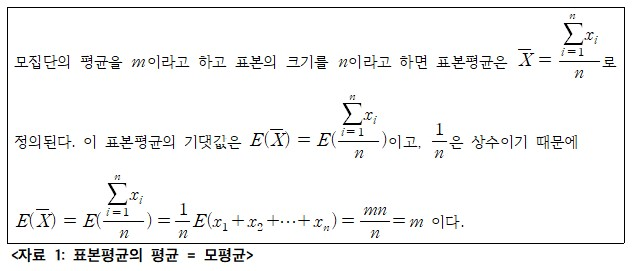
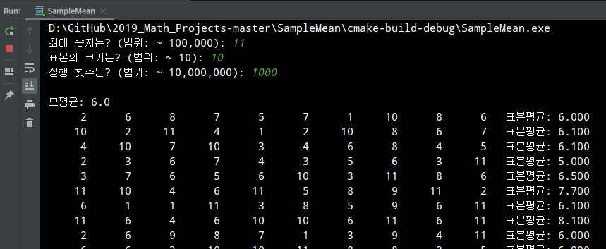
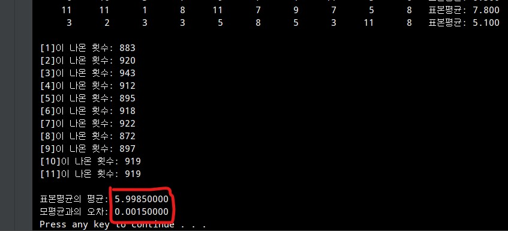
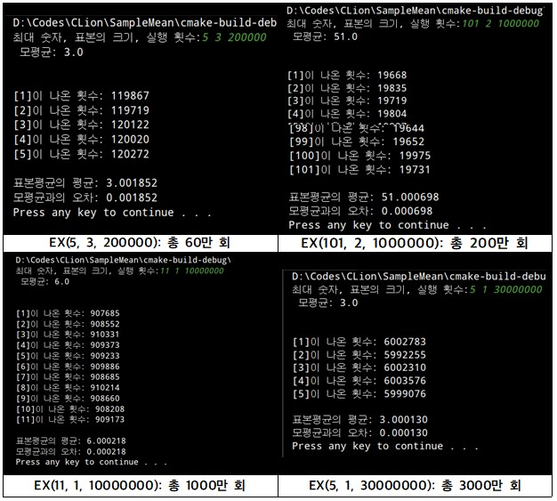

## Sample Mean
### 부제: 표본평균의 평균과 모평균
### [2019.10.29]
***
#### 표본평균의 평균이 모평균인 이유?

통계 단원에서 표본과 추출 등에 관한 내용을 배우고 있을 때쯤이었다. 어느 날 점심을 먹으러 가면서 옆 반 친구와 나눈 이야기가 꽤 호기심을 유발했다. 그가 말한 내용은 이런 것이었다. 

> “한 모집단에 [1, 2, 3, 4, 5]이라는 자료가 들어있다고 가정하자.<sup>[1]</sup> 이 모집단에서 표본의 크기를 n으로 두고 복원추출을 하는데 <u>낮은 확률로 전부 1이 나오면 이때의 표본평균은 1이 된다.</u> 이런 경우들이 무시할 수 없을 정도로 많이 일어난다면 과연 표본평균의 평균이 항상 모평균이 된다고 말할 수 있을까?”

<sub>[1] 이때 모평균은 ```(1+2+3+4+5)/5 = ```3이다.

꽤 그럴싸하지만, 결론부터 말하자면 <u>**표본평균의 평균은 모평균이라고 확실하게 말할 수 있다.**</u> 표본평균은 애초에 확률변수이기 때문에 여러 번 추출 시 매번 달라질 수 있는 값이다. 표본평균의 기댓값이 모평균이 되는 것은 다음 <자료 1>을 통해 쉽게 증명할 수 있다.



하지만 그의 의견은 나에게 충분히 흥미로웠고, 그래서 표본들을 직접 추출해내는 프로그램을 직접 짜보기로 결심하였다. 물론 추출 시행 수가 유한하므로 정확하다고 할 수는 없겠지만, 이 시행 수를 늘려가면 (내가 추출한) 표본평균의 평균이 어디에 근사하는지 알 수 있을 것이라고 생각했다. 

만들 프로그램은 다음과 같이 설계하였다.

n, m, k 세 개의 숫자를 입력받아 1부터 n까지의 숫자를 모집단으로 설정하고, 표본의 크기를 m으로 두어 표본을 추출하고, 그렇게 표본을 k번 추출하여 k개의 표본평균들의 평균을 구해본다.<br />지금부터 편의상 이 알고리즘을 ```EX(n, m, k)```라고 부르도록 하겠다.

<u>C++11</u>를 사용하여 프로그래밍하였으며, 최대 숫자는 100000 이하, 표본의 크기는 10 이하, 표본 추출 횟수는 1,000만 회 이하의 양의 정수로 설정하였다.

<time.h> 헤더 파일을 포함시켜 rand를 이용한 난수를 바탕으로 해서 C로 코드를 작성할 수도 있었으나, 난수를 좀 더 난수답게(?) 생성하기 위해서 ```mt19937_64(메르센 트위스터)``` 엔진을 사용하였고 <random> 헤더를 포함시킨 C++11을 선택하였다.<sup>[2]</sup>

<sub>[2] 여담이지만 mt19937 엔진은 24번째 메르센 소수인 2^19937-1 의 주기를 가지고 있기 때문에 C의 rand(주기가 2^32) 함수에 비하여 엄청나게 큰 반복 주기와 고른 분포를 지닌다. 또한 비트 연산만으로 알고리즘을 구현하므로 그 속도도 더욱 빠르다고 한다.</sub>

***
작성된 코드 중 일부이다. 전문은 [여기](main.cpp)에서 볼 수 있다.

```cpp
#include <iostream>
#include <iomanip>
#include <cstdlib>
#include <unordered_map>
#include <random>
using namespace std;
unordered_map<int, int> seen;

void sample_mean(int max, int cnt, int size, double mean) {
    // 난수 생성기 (mt19937_64) 정의
    random_device rn;
    mt19937_64 rnd(rn());
    uniform_int_distribution<int> range(1, max);
    double sum = 0, total_mean = 0;

    // ...

    for (int i = 0; i < cnt; i++) {
        sum = 0;
        for (int j = 0; j < size; j++) {
            // 랜덤 수 호출
            int get_rand = range(rnd);
            sum += get_rand;
            seen[get_rand]++;

            // 호출한 수 출력
            cout << setfill(' ') << setw(6);
            cout << get_rand << ' ';
        }

        // (표본 요소 합 / 표본 크기) = 표본평균
        sum /= (double)size;
        total_mean += sum;

        // 표본평균 출력
        cout << fixed << setprecision(3);
        cout << "  표본평균: " << sum << '\n';
    }

    // ...

}
 ```
 <자료 2: 작성된 코드 일부>

 가령 ```EX(11, 10, 1000)```으로 설정하여(모집단을 1부터 11까지, 표본의 크기는 10으로, 시행 횟수는 1000회) 이 프로그램을 실행할 시 다음과 같은 결과를 얻을 수 있다. 



<자료 3: ```EX(11, 10, 1000)``` 실행 결과>

 이 때의 시행 횟수는 유한하므로 표본평균의 평균이 모평균과의 오차가 발생하나 오차값은 매우 근소하고, <u>결국 이 값은 모평균에 근사하게 된다.</u>

 위의 설정값인 EX(11, 10, 1000)을 추가로 10회 반복하여 나온 표본평균의 평균들을 정리했더니 다음과 같았다.

<table>
  <tr>
    <td>5.9745</td>
    <td>5.9362</td>
    <td>5.9885</td>
    <td>5.9524</td>
    <td>6.0209</td>
  </tr>
  <tr>
    <td>5.9719</td>
    <td>5.9917</td>
    <td>6.0102</td>
    <td>6.0224</td>
    <td>5.9938</td>
  </tr>
</table>

<자료 3: EX(11, 10, 1000) 10회 반복 시 표본평균의 기댓값>

보이는 것과 같이 (유한 번 시행 시에도) 표본평균의 기댓값들이 모두 모평균인 6에 근사한다는 것을 알 수 있다. 물론 시행 횟수가 충분히 크지 않기 때문에 오차가 발생하는 것으로 보였다.

오차를 줄이기 위한 방법이 무엇일까. 간단하다. 단순히 시행 횟수를 늘리면 그 오차는 훨씬 줄어들 것이다. 대신 실행 시간이 증가하겠지만 오차가 얼마나 줄어드는지 확인하기 위하여 여러 차례 시행 횟수를 늘려가며 결과를 분석하였다.



<자료 4: ```EX(n, m, k)```에서 mk를 늘리면서 실행한 결과>

시행 횟수가 많아질수록 오차가 C/k꼴로 매우 줄어드는 것을 발견할 수 있었다. (단, C는 오차 관련 상수) 그렇게 된다면 <u>mk → ∞에서 C/k → 0이 되기 때문에</u> 표본평균의 기댓값이 모평균에 한없이 근사하게 된다.

이 시행을 통해 (무한한 시행에서의) 표본평균의 평균은 모평균이 된다는 걸 실험적으로 근사시켜 발견할 수 있었다. 낮은 확률로 고르지 않은 값이 나와 표본평균 몇 개가 평균에서 벗어난 값이 나올지라도, 충분히 많은 시행에서 다른 값이 나올 수 있는 확률변수이기 때문에 결국에 표본평균의 평균은 모평균이 된다.

이렇게 프로그램을 만들고 활용하여 표본평균의 평균을 구하는 유한적 실행에 대해 탐구해보는 시간을 가질 수 있었다.

***
2019.10.29<br />
Aria